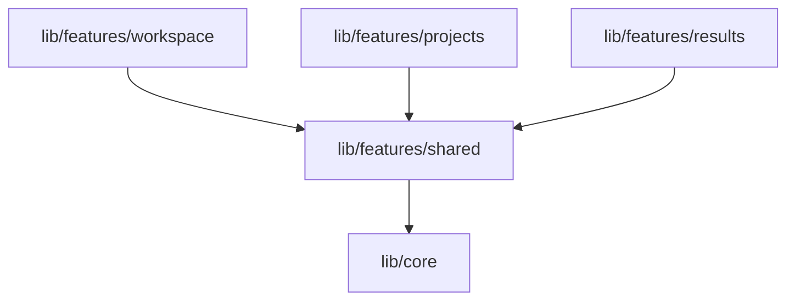

# Feature Refactoring Design

## Goal
Establish a flat feature architecture for `stresspilot_super_app` where vertical presentation features (`projects`, `results`, `workspace`) do not import from each other directly. Instead, all shared business logic, state (providers), and data layers (repositories, models) are moved to the `shared` feature package, and presentation features only depend on `shared`.

---

## Current Violations & Circular Dependencies
Currently, the codebase contains several cross-feature imports that violate the independent Feature-First architecture:
1. **Results -> Projects**:
   - `recent_runs_page.dart` imports `runs_list_widget.dart` from `projects`.
   - `results_provider.dart` imports `flow_repository.dart` from `projects`.
2. **Projects -> Results**:
   - `runs_list_widget.dart` imports `run_repository.dart`, `run_provider.dart`, and `run.dart` from `results`.
   - `run_flow_dialog.dart` imports `run_provider.dart` from `results`.
3. **Projects -> Workspace**:
   - `node_configuration_dialog.dart` imports `canvas.dart` from `workspace`.
4. **Projects -> Endpoints**:
   - `node_configuration_dialog.dart` imports `endpoint_provider.dart` and `endpoint.dart` from `endpoints`.
5. **Workspace -> Projects**:
   - Multiple files in `workspace` (`canvas_provider.dart`, `workspace_canvas.dart`, etc.) import `flow.dart`, `flow_provider.dart`, `project_provider.dart`, `flow_dialog.dart`, `run_flow_dialog.dart`, `subflow_configuration_dialog.dart`.
6. **Workspace -> Endpoints**:
   - Multiple files in `workspace` import `endpoint.dart` and `endpoint_provider.dart`.
7. **Workspace -> Results**:
   - `workspace_canvas.dart` imports `run_provider.dart`.
8. **Shared -> Endpoints**:
   - `endpoint_editor.dart` (in `shared`) imports headers/tabs/response panel widgets from `endpoints` presentation.

---

## Target Architecture (Flat Features)
Every feature under `lib/features/` should follow a flat package diagram where they only depend on `shared` (and `core`).

To achieve this:
1. **All shared Models, Repositories, and Providers** will be relocated to `lib/features/shared/`.
2. **Feature-specific UI widgets** (dialogs, tables, sub-panels) will be relocated to their respective consuming features.
3. **Strict dependency rules** will ensure features do not cross-import.

---

## Proposed Relocations

### 1. Relocate to `lib/features/shared` (Domain & State)
All domain entities and their state managers (providers) must reside in `shared` to be accessible globally:

*   **Projects State:**
    - `lib/features/projects/domain/models/project.dart` -> `lib/features/shared/domain/models/project.dart`
    - `lib/features/projects/domain/repositories/project_repository.dart` -> `lib/features/shared/domain/repositories/project_repository.dart`
    - `lib/features/projects/data/repositories/project_repository_impl.dart` -> `lib/features/shared/data/repositories/project_repository_impl.dart`
    - `lib/features/projects/presentation/provider/project_provider.dart` -> `lib/features/shared/presentation/provider/project_provider.dart`

*   **Flows State:**
    - `lib/features/projects/domain/models/flow.dart` -> `lib/features/shared/domain/models/flow.dart`
    - `lib/features/projects/domain/repositories/flow_repository.dart` -> `lib/features/shared/domain/repositories/flow_repository.dart`
    - `lib/features/projects/data/repositories/flow_repository_impl.dart` -> `lib/features/shared/data/repositories/flow_repository_impl.dart`
    - `lib/features/projects/presentation/provider/flow_provider.dart` -> `lib/features/shared/presentation/provider/flow_provider.dart`

*   **Endpoints State:**
    - `lib/features/endpoints/domain/models/endpoint.dart` -> `lib/features/shared/domain/models/endpoint.dart`
    - `lib/features/endpoints/domain/repositories/endpoint_repository.dart` -> `lib/features/shared/domain/repositories/endpoint_repository.dart`
    - `lib/features/endpoints/data/repositories/endpoint_repository_impl.dart` -> `lib/features/shared/data/repositories/endpoint_repository_impl.dart`
    - `lib/features/endpoints/presentation/provider/endpoint_provider.dart` -> `lib/features/shared/presentation/provider/endpoint_provider.dart`

*   **Runs State:**
    - `lib/features/results/domain/models/run.dart` -> `lib/features/shared/domain/models/run.dart`
    - `lib/features/results/domain/repositories/run_repository.dart` -> `lib/features/shared/domain/repositories/run_repository.dart`
    - `lib/features/results/data/repositories/run_repository_impl.dart` -> `lib/features/shared/data/repositories/run_repository_impl.dart`
    - `lib/features/results/presentation/provider/run_provider.dart` -> `lib/features/shared/presentation/provider/run_provider.dart`

*   **Shared Widgets:**
    - `lib/features/projects/presentation/widgets/flow_dialog.dart` -> `lib/features/shared/presentation/widgets/flow_dialog.dart` (Refactor: accept `projectId` parameter to remove dependency on `ProjectProvider` interface).
    - `lib/features/projects/presentation/widgets/run_flow_dialog.dart` -> `lib/features/shared/presentation/widgets/run_flow_dialog.dart` (Used by multiple features, now only consumes shared provider states).
    - `lib/features/endpoints/presentation/widgets/endpoint_type_badge.dart` -> `lib/features/shared/presentation/widgets/endpoint_type_badge.dart` (Shared UI badge).
    - `lib/features/endpoints/presentation/widgets/json_viewer.dart` -> `lib/features/shared/presentation/widgets/json_viewer.dart` (Generic JSON viewing).
    - `lib/features/endpoints/presentation/widgets/key_value_editor.dart` -> `lib/features/shared/presentation/widgets/key_value_editor.dart` (Generic editor widget).
    - `lib/features/endpoints/presentation/widgets/editor/*` -> `lib/features/shared/presentation/widgets/endpoints/editor/*` (Integrate editor widgets directly under shared with `EndpointEditor`).

### 2. Relocate to `lib/features/workspace` (Workspace presentation only)
*   `lib/features/projects/presentation/widgets/node_configuration_dialog.dart` -> `lib/features/workspace/presentation/widgets/node_configuration_dialog.dart` (Only used by `workspace_canvas.dart`).
*   `lib/features/projects/presentation/widgets/subflow_configuration_dialog.dart` -> `lib/features/workspace/presentation/widgets/subflow_configuration_dialog.dart` (Only used by `workspace_canvas.dart`).

### 3. Relocate to `lib/features/results` (Results presentation only)
*   `lib/features/projects/presentation/widgets/runs_list_widget.dart` -> `lib/features/results/presentation/widgets/runs_list_widget.dart` (Only used by `recent_runs_page.dart`).

---

## Success Criteria & Verification
1. No dart file inside `lib/features/projects`, `lib/features/results`, `lib/features/workspace` will import from any sibling feature folder directly. All imports from features must be `package:stress_pilot/features/shared/`.
2. The project compiles successfully without any missing files or broken references.
3. Tests run and pass.
4. Dependency Injection (`locator.dart`) is updated to register the repositories and providers from the new paths.
